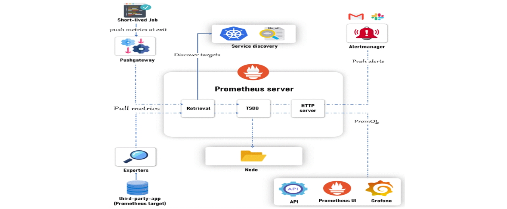
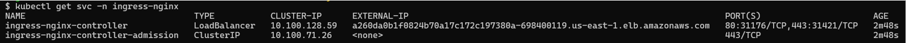
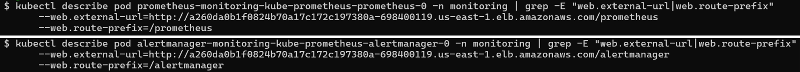
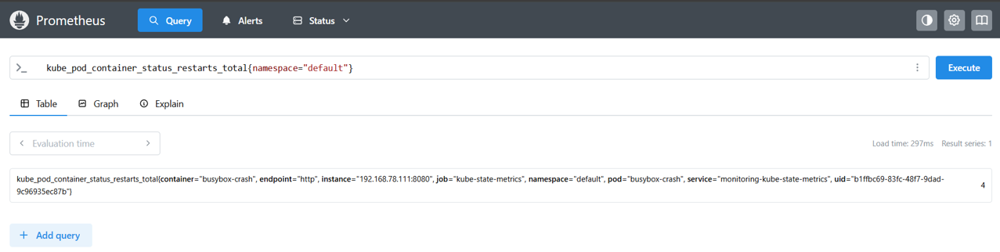
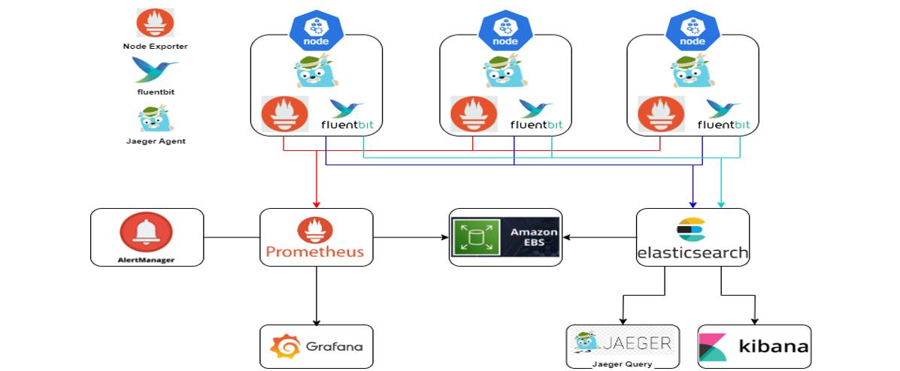
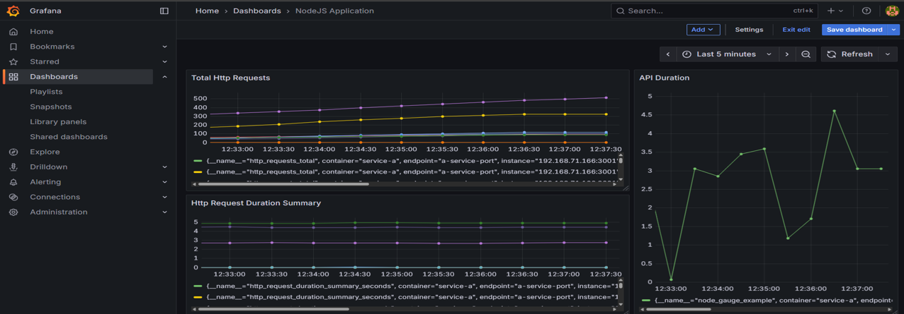

# <p align="center">Observability</p>


## Observability
* **Observability**: The ability to understand the internal state of a system by analyzing the data it produces (logs, metrics, traces).
  * **Monitoring (Metrics):** Tracks system health (CPU, memory, network).
    * *`Tells us what is happening.`*
  * **Logging (Logs):** Captures detailed event data from system components.
    * *`Explains why it is happening.`*
  * **Tracing (Traces):** Tracks the path of requests across services.
    * *`Shows how it is happening.`*
### Why Monitoring?
* Ensures systems are working properly by maintaining **health, performance, and security**.
* **Purpose**: Early detection of issues → prevent downtime/data loss.
* **Use Cases**:
  * Detect problems early
  * Measure performance
  * Ensure availability
### Why Observability?
* Goes beyond monitoring → helps explain *why* issues occur.
* Provides deeper system insights for diagnosis and optimization.
* **Use Cases**:
  * Diagnose issues
  * Understand behavior
  * Improve systems
### Monitoring vs Observability
* **Key Difference**
  * Monitoring → *When & What*
  * Observability → *Why & How*
#### Monitoring
* Checks if the system is working as expected.
* Uses **metrics** like CPU, memory, error rates.
* Triggers when a **threshold** is crossed (e.g., CPU > 90%).
* Sends alert if CPU usage goes above 90%.
* Helps detect issues early before they cause outages.
#### Observability
* Explains **why** the system behaves a certain way.
* Uses **metrics + logs + traces** together.
* Correlates different signals to find **root cause**.
* Traces a **slow user request** across multiple services to find the bottleneck.
* Helps diagnose problems and optimize overall system behavior.
### Does Observability Cover Monitoring?
* **Yes** → Monitoring is a **subset of Observability**.
* Monitoring = track predefined metrics
* Observability = complete system picture (metrics + logs + traces)
### What Can Be Monitored?
* **Infrastructure**: CPU, memory, disk I/O, network
* **Applications**: Response times, error rates, throughput
* **Databases**: Query performance, connection pool, transaction rate
* **Network**: Latency, packet loss, bandwidth
* **Security**: Unauthorized access, firewall logs, vulnerabilities
### What Can Be Observed?
* **Logs** → Detailed event records
* **Metrics** → Quantitative data (CPU load, request counts)
* **Traces** → Request flow across services
### Monitoring vs Observability in Environments
#### Bare-Metal Servers
* **Monitoring**: Direct hardware metrics, simpler (fewer layers).
* **Observability**: Easier correlation due to fewer moving parts.
#### Kubernetes
* **Monitoring**: Challenging (ephemeral containers, scaling, distributed nature).
* **Observability**: Complex, requires advanced tools for correlation & tracing.
### Tools for Monitoring & Observability
* **Monitoring Tools**:
  * Prometheus, Grafana, Nagios, Zabbix, PRTG
* **Observability Tools**:
  * **Logs:** ELK Stack (Elasticsearch, Logstash, Kibana), EFK Stack (Elasticsearch, FluentBit, Kibana), Splunk
  * **Tracing:** Jaeger, Zipkin
  * **APM/Full-Stack:** New Relic, Dynatrace, Datadog
### Metrics vs Monitoring
* **Metrics**:
  * Individual measurements/data points (e.g., CPU usage, memory, request latency).
  * Example: Heart rate, temperature, steps walked.
* **Monitoring**:
  * The process of continuously observing metrics over time.
  * Helps identify normal vs abnormal behavior.
  * Example: Checking daily step count to see if you meet your goal.
> **Metrics = Raw Data** | **Monitoring = Process of analyzing & acting on metrics**

---

## Prometheus
* Open-source **monitoring & alerting toolkit** (originally built at SoundCloud).
* Key Features:
  * **Time-series database (TSDB)** for efficient metric storage.
  * **PromQL** (powerful query language).
  * **Alerting** based on metric thresholds.
  * Works on **bare-metal servers** & **containerized environments** (Kubernetes).
### Prometheus Architecture
  
#### Prometheus Server (Core Component)
* **Responsibilities**: Scrapes metrics, stores them, makes data queryable.
* **Modules**:
  * **Retrieval** → Scrapes metrics from targets (via static config or service discovery).
  * **TSDB (Time Series DB)** → Stores metrics efficiently.
  * **HTTP Server** → Exposes data via API and PromQL.
* **Storage**: Data stored locally (HDD/SSD) in time-series optimized format.
#### Service Discovery
* Automatically finds scrape targets (services/apps).
* **Use Cases**:
  * **Kubernetes** → Discovers pods, services, nodes via API.
  * **File SD** → Reads static target list from files (for non-dynamic systems).
#### Pushgateway
* For **short-lived jobs** that cannot be scraped directly.
* Jobs push metrics → Pushgateway → Prometheus scrapes.
* **Example**: Batch jobs, CI/CD tasks.
#### Alertmanager
* Handles alerts generated by Prometheus.
* Features:
  * Deduplication
  * Grouping
  * Routing to channels (Email, Slack, PagerDuty, etc.)
#### Exporters
* Applications that expose metrics in Prometheus format.
* **Types**:
  * **Node Exporter** → Hardware/system metrics.
  * **MySQL Exporter** → Database metrics.
  * Many others for apps, middleware, and infra.
#### Prometheus Web UI
* Run ad-hoc **PromQL queries**.
* Explore collected metrics.
* Basic visualization (though limited compared to Grafana).
#### Grafana
* Visualization & dashboard tool.
* Integrates with Prometheus for **rich, customizable dashboards**.
#### API Clients
* Prometheus provides **HTTP APIs**.
* Useful for integrations with external systems or custom apps.
### Installing Prometheus on AWS EKS
#### Step:1 `Create EKS Cluster`
* **Prerequisites:**
  * Install and configure:
    * **AWS CLI** → [Guide](https://docs.aws.amazon.com/cli/latest/userguide/getting-started-install.html)
    * **eksctl** → [Guide](https://eksctl.io/installation/)
    * **kubectl** → [Guide](https://kubernetes.io/docs/tasks/tools/)
* **Create EKS Cluster:**  
  ```bash
  eksctl create cluster --name=observability \
    --region=us-east-1 \
    --zones=us-east-1a,us-east-1b \
    --without-nodegroup
  ```
* **Associate IAM OIDC Provider:**
  ```bash
  eksctl utils associate-iam-oidc-provider \
    --region us-east-1 \
    --cluster observability \
    --approve
  ```
* **Create Nodegroup:**
  ```bash
  eksctl create nodegroup --cluster=observability \
    --region=us-east-1 \
    --name=observability-ng-private \
    --node-type=t3.medium \
    --nodes-min=2 \
    --nodes-max=3 \
    --node-volume-size=20 \
    --managed \
    --asg-access \
    --external-dns-access \
    --full-ecr-access \
    --appmesh-access \
    --alb-ingress-access \
    --node-private-networking
  ```
* **Update kubeconfig:**
  ```bash
  aws eks update-kubeconfig --name observability
  ```
#### Step:2 `Install kube-prometheus-stack (via Helm)`
* Add Prometheus Helm Chart and Update:
  ```bash
  helm repo add prometheus-community https://prometheus-community.github.io/helm-charts
  helm repo update
  ```
#### Step:3 `Deploy to "monitoring" Namespace`
* Create Namespace:
  ```bash
  kubectl create ns monitoring
  ```
* Install Prometheus using Helm:
  ```bash
  helm install monitoring prometheus-community/kube-prometheus-stack \
    -n monitoring \
    -f ./custom-values.yaml
  ```
> Installing Prometheus using Helm also includes Grafana as part of the deployment.
* **`custom-values.yaml:`**
  ```yaml
  alertmanager:
    alertmanagerSpec:
      alertmanagerConfigSelector:
        matchLabels:
          release: monitoring
  
      replicas: 2
  
      alertmanagerConfigMatcherStrategy:
        type: None
  ```
  * **`alertmanagerConfigSelector:`**
    * Alertmanager will **only load `AlertmanagerConfig` CRDs** that have a **label** matching `release=monitoring`.
  * **`replicas: 2`**
    * Runs **two Alertmanager pods** instead of one. If one pod fails, alerts are still handled.
  * **`alertmanagerConfigMatcherStrategy:`**
    * This disables the namespace restriction.
    * Now your Alertmanager will load `AlertmanagerConfig` objects from **any namespace**, as long as they still match the label selector (`alertmanagerConfigSelector`).
#### Step:4 `Verify Installation`
* Check resources:
  ```bash
  kubectl get all -n monitoring
  ```
* Access UIs:
  * **Prometheus UI**
    ```bash
    kubectl port-forward service/prometheus-operated -n monitoring 9090:9090
    ```
    > (*Use `--address 0.0.0.0` if running on EC2/VM*)
  * **Grafana UI** (default Username: `admin`, Password: `prom-operator`)
    ```bash
    kubectl port-forward service/monitoring-grafana -n monitoring 8080:80
    ```
  * **Alertmanager UI**:
    ```bash
    kubectl port-forward service/alertmanager-operated -n monitoring 9093:9093
    ```
* Instead of using `kubectl port-forward`, configure an **Ingress** to access the UIs externally.
#### Step:5 `Cleanup`
* Uninstall Prometheus stack:
  ```bash
  helm uninstall monitoring --namespace monitoring
  ```
* Delete namespace:
  ```bash
  kubectl delete ns monitoring
  ```
* Delete EKS cluster:
  ```bash
  eksctl delete cluster --name observability
  ```

---

## IAM OIDC Provider in EKS
* **OIDC (OpenID Connect)** is an identity layer on top of OAuth2 that allows authentication and issuing tokens.
* AWS EKS integrates with OIDC to let **Kubernetes service accounts** securely assume **IAM roles**.
### Need of OIDC in EKS
* By default, **pods inside Kubernetes cannot directly access AWS services** (like S3, CloudWatch, DynamoDB, etc.) securely.
* Without OIDC:
  * You’d have to give **node IAM roles** broad permissions, which is insecure (all pods inherit them).
* With OIDC:
  * You can **map specific Kubernetes service accounts to IAM roles** using `IRSA (IAM Roles for Service Accounts)`.
  * This gives **fine-grained AWS permissions only to the pods that need them**.
### Needs of OIDC in Prometheus
* Prometheus/Grafana may need to:
  * **Scrape CloudWatch metrics**.
  * Store data in **S3 buckets** (long-term retention).
  * Access **AWS APIs** for scaling or alerting integrations.
* For these cases, the pod must assume an IAM role.
* OIDC enables this by letting **Kubernetes service accounts get AWS IAM permissions without storing credentials inside pods**.
### What Happens When You Run
* **Command:**
  ```bash
  eksctl utils associate-iam-oidc-provider \
    --region us-east-1 \
    --cluster observability \
    --approve
  ```
* **When you run this command:**
  * It **creates an OIDC identity provider** for your EKS cluster in AWS IAM.
  * This OIDC provider is **linked to your EKS cluster**.
  * After this:
    * You can create **IAM Roles for Service Accounts (IRSA)**.
    * Example: `prometheus-sa` in Kubernetes can assume `PrometheusIAMRole` in AWS.
### Workflow (High-Level)
* You deploy Prometheus pod with a **Kubernetes Service Account** (`prometheus-sa`).
* That service account is **annotated with IAM role ARN**.
* Pod requests an OIDC token from EKS OIDC provider.
* AWS IAM validates the token → allows pod to assume IAM role.
* Pod can now access AWS resources **securely and with least privileges**.

---

## Enable Ingress for Prometheus, Grafana & Alertmanager
### Step:1 `Install NGINX Ingress Controller (LoadBalancer)`
* This installs the community `ingress-nginx` controller and exposes it as a single `LoadBalancer` service.
  ```bash
  helm repo add ingress-nginx https://kubernetes.github.io/ingress-nginx
  helm repo update

  kubectl create namespace ingress-nginx

  helm install ingress-nginx ingress-nginx/ingress-nginx \
    --namespace ingress-nginx \
    --set controller.service.type=LoadBalancer \
    --set controller.service.externalTrafficPolicy=Local
  ```
  > *(Optional)* to request an AWS NLB instead of the classic ELB you can add a service annotation via `--set controller.service.annotations."service\.beta\.kubernetes\.io/aws-load-balancer-type"=nlb`
* After this, find the LoadBalancer DNS/Name that AWS created:
  ```bash
  kubectl get svc -n ingress-nginx
  # look at EXTERNAL-IP/HOSTNAME for the ingress-nginx controller service
  ```
  
* Use that LB DNS in the Ingress manifest below as the `host:`.
### Step:2 `Create one Ingress with path-based routing (Ingress YAML)`
* Save this as `monitoring-ingress.yaml` and apply it `kubectl apply -f monitoring-ingress.yaml`.
  ```yaml
  apiVersion: networking.k8s.io/v1
  kind: Ingress
  metadata:
    name: monitoring-ingress
    namespace: monitoring
  spec:
    ingressClassName: nginx
    rules:
    - host: monitoring.suribabudevops.shop
      http:
        paths:
        - path: /prometheus
          pathType: Prefix
          backend:
            service:
              name: monitoring-kube-prometheus-prometheus
              port:
                number: 9090
        - path: /grafana
          pathType: Prefix
          backend:
            service:
              name: monitoring-grafana
              port:
                number: 80
        - path: /alertmanager
          pathType: Prefix
          backend:
            service:
              name: monitoring-kube-prometheus-alertmanager
              port:
                number: 9093
  ```
### Step:3 `Make Prometheus & Alertmanager aware of the subpath (important)`
* Prometheus and Alertmanager need to know they’re reachable under `/prometheus` and `/alertmanager` (otherwise they will redirect to `/` or produce 404s).
#### Option:1 `Patch the Prometheus / Alertmanager CRs the operator created`
* Find the CR names, then patch `spec.externalUrl` and `spec.routePrefix`:
  ```bash
  # list resources
  kubectl get prometheus -n monitoring
  kubectl get alertmanager -n monitoring
  ```
  
  ```bash
  # example patches (replace Names and LB DNS)
  kubectl patch prometheus <prometheus-cr-name> -n monitoring --type merge -p \
    '{"spec":{"externalUrl":"http://<LOAD_BALANCER_DNS>/prometheus","routePrefix":"/prometheus"}}'

  kubectl patch alertmanager <alertmanager-cr-name> -n monitoring --type merge -p \
    '{"spec":{"externalUrl":"http://<LOAD_BALANCER_DNS>/alertmanager","routePrefix":"/alertmanager"}}'
  ```
#### Option:2 `If you installed Prometheus via Helm chart values`
* Set the equivalent `externalUrl` and `routePrefix` in the values file, then upgrade the Helm release.
  1. **Option:1 `Quick inline '--set' command`**
     * If you just want to patch without editing files, run:
       ```bash
       helm upgrade monitoring prometheus-community/kube-prometheus-stack \
         -n monitoring \
         --reuse-values \
         --set prometheus.prometheusSpec.externalUrl="http://a260da0b1f0824b70a17c172c197380a-698400119.us-east-1.elb.amazonaws.com/prometheus" \
         --set prometheus.prometheusSpec.routePrefix="/prometheus" \
         --set alertmanager.alertmanagerSpec.externalUrl="http://a260da0b1f0824b70a17c172c197380a-698400119.us-east-1.elb.amazonaws.com/alertmanager" \
         --set alertmanager.alertmanagerSpec.routePrefix="/alertmanager"
       ```
  2. **Option:2 `Persistent 'values.yaml'`**
     * Better for version control. Added in the `custom-values.yaml` file:
       ```yaml
       prometheus:
         prometheusSpec:
           externalUrl: "http://a260da0b1f0824b70a17c172c197380a-698400119.us-east-1.elb.amazonaws.com/prometheus"
           routePrefix: "/prometheus"
       
       alertmanager:
         alertmanagerSpec:
           externalUrl: "http://a260da0b1f0824b70a17c172c197380a-698400119.us-east-1.elb.amazonaws.com/alertmanager"
           routePrefix: "/alertmanager"
       ```
     * [Refer Here](https://github.com/SuriBabuKola/Observability/commit/3632e6cc2b537bacf2df280c44a0cae2f683b668) for the updated `custom-values.yaml`.
     * Then upgrade the release:
       ```bash
       helm upgrade monitoring prometheus-community/kube-prometheus-stack \
         -n monitoring \
         -f custom-values.yaml
       ```
#### Verify after upgrade
* Check that the operator updated the pods:
  ```bash
  kubectl get pods -n monitoring
  kubectl describe pod <prometheus-pod> -n monitoring | grep -E "web.external-url|web.route-prefix"
  ```
* You should see Prometheus running with flags like:
  ```
  --web.external-url=http://<LB-DNS>/prometheus
  --web.route-prefix=/prometheus
  ```
* Same idea for Alertmanager.
  
### Step:4 `Make Grafana serve correctly from '/grafana' (important)`
* Grafana often redirects to `/login` or to the root unless Grafana itself knows it’s served under `/grafana`. Configure **two** things:
  * `root_url` to include the `/grafana/` path
  * `serve_from_sub_path = true`
* If Grafana is the subchart of your `kube-prometheus-stack`, you can set these via Helm values.
#### Option:1 `Apply with Helm with '--set'`
  * If you just want to patch without editing files, run:
    ```bash
    helm upgrade monitoring prometheus-community/kube-prometheus-stack \
      -n monitoring \
      --reuse-values \
      --set grafana.grafana.ini.server.root_url="http://monitoring.suribabudevops.shop/grafana/" \
      --set grafana.env.GF_SERVER_SERVE_FROM_SUB_PATH="true"
    ```
#### Option:2 `Persistent 'values.yaml'`
* Better for version control. Add in `custom-values.yaml` like this:
  ```yaml
  grafana:
    adminPassword: "admin"
  
    grafana.ini:
      server:
        root_url: "http://monitoring.suribabudevops.shop/grafana/"
  
    env:
      GF_SERVER_SERVE_FROM_SUB_PATH: "true"
  ```
  * **Note:**
    1. `grafana.adminPassword: "admin"`  
       * Sets a fixed admin password for Grafana. Avoid weak passwords in production.
    2. `grafana.persistence.enabled: true`  
       * Ensures dashboards and data persist across pod restarts by attaching a Persistent Volume Claim (PVC).
* [Refer Here](https://github.com/SuriBabuKola/Observability/commit/05c7e780349290e566ab7723144b15db0bf060a7) for the updated `custom-values.yaml`.
* Then upgrade:
  ```bash
  helm upgrade monitoring prometheus-community/kube-prometheus-stack \
    -n monitoring \
    -f custom-values.yaml
  ```
> **Important:**
>   * **Prometheus & Alertmanager** → `externalUrl` + `routePrefix` are enough, they work fine with LoadBalancer DNS.
>   * **Grafana** → **must know the exact domain/subpath**.
>     * Needs:   
>       * `root_url = "http://<domain>/grafana/"`
>       * `GF_SERVER_SERVE_FROM_SUB_PATH=true`
>     * Otherwise Grafana redirects to `/login` or loads broken assets.
>  * Difference = **Grafana is stricter about domain + subpath than Prometheus/Alertmanager**.
#### Verify Grafana after upgrade
* Check the Grafana pod config:
  ```bash
  kubectl get pods -n monitoring
  kubectl describe pod <grafana-pod> -n monitoring | grep -i GF_SERVER
  ```
* You should see something like:
  ```
  GF_SERVER_SERVE_FROM_SUB_PATH=true
  ```
  
### Step:5 `Test URLs`
* Open in a browser:
  * `http://monitoring.suribabudevops.shop/prometheus` → Prometheus UI.
  * `http://monitoring.suribabudevops.shop/grafana` → Grafana login.
  * `http://monitoring.suribabudevops.shop/alertmanager` → Alertmanager UI.
> If you are not configuring any domain names, directly access the Load Balancer DNS address.

---

## Metrics in Prometheus
* Metrics are **measurements collected over time** from monitored systems (e.g., CPU usage, memory usage, pod restarts).
* They provide insights into the **performance, health, and behavior** of systems and applications.
* All metrics are stored in Prometheus’s **TSDB (Time Series Database)**.

## Labels
* Labels are **key-value pairs** attached to metrics.
* They provide additional dimensions to metrics, allowing you to **filter, group, or differentiate** them.
* **Example:**
  ```bash
  container_cpu_usage_seconds_total{namespace="kube-system", endpoint="https-metrics"}
  ```
  * `container_cpu_usage_seconds_total` → Metric name.
  * `{namespace="kube-system", endpoint="https-metrics"}` → Labels.

## PromQL (Prometheus Query Language)
* PromQL is a **query language** for retrieving and manipulating time series data stored in Prometheus.
* **Capabilities:**
  * Select specific metrics & apply filters.
  * Perform mathematical operations.
  * Aggregate across labels.
  * Use built-in functions for advanced analysis.
### PromQL Examples
* **Basic metric:**
  ```bash
  container_cpu_usage_seconds_total
  ```
  * Returns all time series of this metric.
* **Filter by labels:**
  ```bash
  container_cpu_usage_seconds_total{namespace="kube-system",pod=~"kube-proxy.*"}
  ```
* **Range vector (last 5 minutes):**
  ```bash
  container_cpu_usage_seconds_total{namespace="kube-system",pod=~"kube-proxy.*"}[5m]
  ```
### PromQL Aggregations & Functions
#### 1. **Aggregations**
* Aggregation operators combine values from multiple time series into one (or fewer).
  1. **Sum CPU usage across nodes:**
     ```promql
     sum(rate(node_cpu_seconds_total[5m]))
     ```
     * `node_cpu_seconds_total` = cumulative CPU seconds used by the node.
     * `rate(...[5m])` = per-second CPU usage (averaged over last 5 minutes).
     * `sum(...)` = adds up CPU usage from **all CPUs/nodes** → gives **total cluster CPU usage per second**.
     > Useful when you want cluster-wide CPU usage.
  2. **Average memory usage per namespace:**
     ```promql
     avg(container_memory_usage_bytes) by (namespace)
     ```
     * `container_memory_usage_bytes` = current memory usage by each container.
     * `avg(... by (namespace))` = averages all container memory usage **grouped by namespace**.
     > Shows how much memory each namespace is using on average.
#### 2. **Functions**
* Functions transform or calculate values over time series.
  1. **rate()**
     ```promql
     rate(container_cpu_usage_seconds_total[5m])
     ```
     * `container_cpu_usage_seconds_total` = counter of total CPU seconds consumed by a container.
     * `rate(...[5m])` = calculates **per-second CPU usage averaged over the past 5 minutes**.
     > Helps avoid spikes (smoothed out usage).
  2. **increase()**
     ```promql
     increase(kube_pod_container_status_restarts_total[1h])
     ```
     * `kube_pod_container_status_restarts_total` = counter of pod/container restarts.
     * `increase(...[1h])` = how many restarts happened in the **last 1 hour**.
     > Useful for alerting when containers restart too often.
  3. **histogram\_quantile()**
     ```promql
     histogram_quantile(0.95, sum(rate(apiserver_request_duration_seconds_bucket[5m])) by (le))
     ```
     * `apiserver_request_duration_seconds_bucket` = histogram of request durations to API server.
     * `sum(rate(...[5m])) by (le)` = gets per-second rate of requests per latency bucket (`le = less or equal`).
     * `histogram_quantile(0.95, ...)` = computes the **95th percentile latency**.
       * 95% of requests finished faster than this value.
       * Good for **SLOs (Service Level Objectives)**.

## Important Metric Sources in Kubernetes
* **Node Exporter:** Collects node-level metrics (CPU, memory, disk, network).
  * Runs as a **DaemonSet** → must run on every node.
  * Access via `/metrics` endpoint.
* **Kube-State-Metrics:** Collects metrics from the **Kubernetes API server** (e.g., pod restarts, deployments).
* **Custom Metrics:** Application-specific (e.g., HTTP response times, number of logins).
* **Database Exporters:** e.g., MySQL Exporter for database health and performance metrics.

## Verifying Metrics Collection
* Check Pods and Services in the Monitoring Namespace:
  ```bash
  kubectl get pods -n monitoring
  kubectl get svc -n monitoring
  ```
* The `Node Exporter` and `Kube-State-Metrics` services are of type `ClusterIP`, so they can be accessed within the Kubernetes Cluster network.
* Connect to one of the Worker Nodes using `Session Manager` and run the `curl` command:
  * **For Node Exporter:**
    ```bash
    curl <node-exporter-ClusterIP>:<port>/metrics
    ```
  * **For Kube-State-Metrics:**
    ```bash
    curl <kube-state-metrics-ClusterIP>:<port>/metrics
    ```
* The `/metrics` endpoint provides all the information they collect.
* Based on this data, you can query the metrics.

## Using Prometheus to Query Metrics
* Access Prometheus via a web browser.
* In the `Search Expression` field, enter a metric collected by `Kube-State-Metrics`.
  * Example: `kube_pod_container_status_restarts_total`
* Click `Execute` to run the query.
* The results will be displayed. By clicking the **Graph** tab, the data can be visualized as a graph.
* Refine the query to filter by namespace using **Labels**.
  * Example: `kube_pod_container_status_restarts_total{namespace="default"}`
### Testing Prometheus with a Crash Loop Pod
* To verify that Prometheus is correctly scraping metrics from `kube-state-metrics`:
  * Deploy a pod that continuously crashes:
    ```bash
    kubectl run busybox-crash --image=busybox -- /bin/sh -c "exit 1"
    ```
  * Use Prometheus to confirm that pod restart metrics are being collected.
  

---

## Grafana (Visualization Tool)
* Grafana is a **dashboard and visualization platform** that integrates with Prometheus for creating rich monitoring visuals.
* **Features:**
  * Pre-built dashboards.
  * Authentication and authorization.
  * Supports multiple data sources beyond Prometheus.

### Grafana UI
* Access Grafana via a web browser.

#### Using Dashboards
* Navigate to `Dashboards`, where predefined dashboards are available.
* Select a dashboard, such as `Kubernetes/Compute Resources/Namespace (Pods)`.
  * Choose the data source (`Prometheus`) and namespace.
  * View CPU and memory usage.

#### Creating a Custom Dashboard
* Go to `Dashboards → New → New dashboard`.
* Click **Add visualization**.
* Select the data source `Prometheus`.
* Write a query in the **Metric browser**.
* Run the query → Apply → Save the dashboard.

#### Data Sources
* Navigate to: `Connections → Data sources`.
* Default data sources are listed here.
* Click `Add new data source` to add additional data sources.
  * Select the required data source and configure it.

---

## Instrumentation
* Instrumentation is the process of adding monitoring capabilities to your applications, systems, or services.
* It involves embedding code or using tools to collect **metrics, logs, and traces** that provide insights into system health and performance.
### Purpose of Instrumentation
* **Visibility**: Understand the internal state of applications & infrastructure.
* **Metrics Collection**: By collecting key metrics like CPU usage, memory consumption, request rates, error rates, etc., you can understand the health and performance of your system.
* **Troubleshooting**: When something goes wrong, instrumentation allows you to diagnose the issue quickly by providing detailed insights.
### How it Works
* **Code-Level Instrumentation**: Developers add monitoring code inside the application (e.g., using `prom-client` in Node.js) to expose custom metrics.
* **Exporters**: Collect metrics from systems and expose them to Prometheus
  * **Node Exporter** → Node-level metrics (CPU, memory, disk).
  * **MySQL/Postgres Exporters** → Database metrics.
  * **Custom Metrics** → Application-specific metrics.
> Exporters cannot capture **application-specific** behavior (like "user logins per minute"), so **developers must instrument custom metrics inside the application**.

## Metric Types in Prometheus
1. **Counter:**
   * A Counter is a cumulative metric that represents a single numerical value that **only goes up**. It is used for counting events like the number of HTTP requests, errors, or tasks completed.
   * **Example:**
     * Counting the number of times a container restarts in your Kubernetes cluster
     * `kube_pod_container_status_restarts_total`
2. **Gauge:**
   * A Gauge is a metric that represents a single numerical value that can **go up and down**. It is typically used for things like memory usage, CPU usage, or the current number of active users.
   * **Example:**
     * Monitoring the memory usage of a container in your Kubernetes cluster.
     * `container_memory_usage_bytes`
3. **Histogram:**
   * A Histogram samples observations into configurable **buckets**.
   * Used for things like request durations or response sizes.
   * **Example:**
     * Measuring the response time of Kubernetes API requests in various time buckets.
     * `apiserver_request_duration_seconds_bucket`
4. **Summary:**
   * Similar to a Histogram, A Summary samples observations and provides a total count of observations, their sum, and configurable quantiles (percentiles).
   * **Example:**
     * Monitoring the 95th percentile of request durations to understand high latency in your Kubernetes API.
     * `apiserver_request_duration_seconds_sum`

---

## Project Objectives
* **Implement Custom Metrics in Node.js Application:** Use the `prom-client` library to write and expose custom metrics in the Node.js application.
* **Set Up Alerts in Alertmanager:** Configure Alertmanager to send email notifications if a container crashes more than two times.
* **Set Up Logging:** Implement logging for both application and cluster (node) logs to enhance observability using the EFK stack (Elasticsearch, FluentBit, Kibana).
* **Implement Distributed Tracing for Node.js Application:** Enhance observability by instrumenting the Node.js application for distributed tracing using Jaeger, enabling better performance monitoring and troubleshooting of complex, multi-service architectures.
### Architecture
* Architecture Daigram:
  
### Getting Custom Metrics into Prometheus
#### Step:1 `Instrument the Application`
* Developers add custom metrics (Counters, Gauges, Histograms, Summaries) to the application code.
* [Refer Here](https://github.com/SuriBabuKola/Observability/tree/main/Examples/Project-1/Application) for the application code. The custom metrics are defined in the `service-a/index.js` file.
* Integrates Prometheus for monitoring HTTP requests using the `prom-client` library:
  * `http_requests_total` → Counter
  * `http_request_duration_seconds` → Histogram
  * `http_request_duration_summary_seconds` → Summary
  * `node_gauge_example` → Gauge
* Application Basic Routes:
  * `/` → Returns a "Running" status.
  * `/healthy` → Returns the health status of the server.
  * `/serverError` → Simulates a 500 Internal Server Error.
  * `/notFound` → Simulates a 404 Not Found error.
  * `/logs` → Generates logs using a custom logging function.
  * `/crash` → Simulates a server crash by exiting the process.
  * `/example` → Tracks async task duration with a gauge.
  * `/metrics` → Exposes the Prometheus metrics endpoint.
  * `/call-service-b` → Calls `service-b` and retrieves data from it.
#### Step:2 `Deploy Application`
* **Build and Push the Application Images:**
  * Containerize the Application and push in to your Registry or use pre-built images:
    ```bash
    # Dockerize Application
    docker build -t <NAME_OF_YOUR_REPO>:<TAG> Application/service-a/
    docker build -t <NAME_OF_YOUR_REPO>:<TAG> Application/service-b/ 

    # Pre-built Images
    abhishekf5/demoservice-a:v
    abhishekf5/demoservice-b:v
    ```
* **Deploy the Application into Kubernetes:**
  * [Refer Here](https://github.com/SuriBabuKola/Observability/tree/main/Examples/Project-1/Kubernetes-Manifests) for the Kubernetes Manifest files.
  * Create `dev` namespce in Kubernetes Cluster.
    ```sh
    kubectl create ns dev
    ```
  * Apply the Kubernetes Manifest files to deploy Application in `dev` namespace.
    ```sh
    kubectl apply -k Kubernetes-Manifests/
    ```
* **Test all the Endpoints:**
  * Open a browser, retrieve the LoadBalancer DNS name, and access the following routes to test the application:
    * `/`
    * `/healthy`
    * `/serverError`
    * `/notFound`
    * `/logs`
    * `/example`
    * `/metrics`
    * `/call-service-b`
  * Alternatively, you can run the automated script, which sends random requests to the LoadBalancer and generates metrics.
    * [Refer Here](https://github.com/SuriBabuKola/Observability/blob/main/Examples/Project-1/test.sh) for the `test.sh` file that sends random requests. Run it using the command below:
      ```bash
      ./test.sh <LOAD_BALANCER_DNS_NAME>
      ```
#### Step:3 `Deploy Prometheus`
* Install Prometheus using **Helm charts**.
* Expose services (via Ingress or LoadBalancer).
#### Step:4 `Service Discovery with ServiceMonitor`
* When querying custom metrics, you may get empty data because Prometheus needs to identify which application's custom metrics to fetch.
* In a cluster with many applications, you must specify which application's custom metrics Prometheus should scrape using Service Discovery.
* Prometheus requires a `ServiceMonitor` manifest to select applications based on **labels**.
* **How ServiceMonitor Works?:**
  * A ServiceMonitor does not scrape Pods directly.
  * It scrapes **Services** that match its `selector.matchLabels`.
  * Then it uses the Service’s `endpoints.port` (e.g., `a-service-port`) and `path` to reach the Pods behind that Service.
* **Application `ServiceMonitor` Manifest File:**
  * `service-monitor.yaml`
    ```yaml
    apiVersion: monitoring.coreos.com/v1
    kind: ServiceMonitor
    metadata:
      labels:
        app: a-service-service-monitor   # ✅ Change: Give a unique name label for the ServiceMonitor
        release: monitoring              # ⚠️ Keep this same as your Helm release name (usually "monitoring")
      name: a-service-service-monitor    # ✅ Change: Unique name for this ServiceMonitor
      namespace: monitoring              # ⚠️ Namespace where the ServiceMonitor will live (usually "monitoring")
    spec:
      jobLabel: job                      # ⚠️ Optional, can keep or adjust if your service has a 'job' label
      endpoints:
        - interval: 2s                   # ✅ Change: Scrape interval (common is 15s or 30s, 2s is too aggressive)
          port: a-service-port           # ✅ Change: Must match the port name in your Service manifest (metadata.name: ports[].name)
          path: /metrics                 # ⚠️ Usually "/metrics", change if your app exposes metrics on a different path
      selector:
        matchLabels:
          app: a-service                 # ✅ Change: Must match labels of the Service that exposes your metrics
      namespaceSelector:
        matchNames:
          - dev                          # ✅ Change: Namespace where your target Service is running
    ```
  * **Explanation:**
    1. **`selector.matchLabels`**:
       * Prometheus Operator will look for **Services** in the target namespace (`dev`, from `namespaceSelector.matchNames`) that have the label `app=a-service`.
    2. **`endpoints`**:
       * Specifies the port (`a-service-port`) and path (`/metrics`) Prometheus should use to scrape metrics.
* Apply the `ServiceMonitor` YAML manifest (`kubectl apply -f service-monitor.yaml`). Wait for 4-5 minutes, then check the Prometheus UI to confirm that the custom metrics implemented in the Node.js application are being scraped:
  * `http_requests_total`
  * `http_request_duration_seconds`
  * `http_request_duration_summary_seconds`
  * `node_gauge_example`
* Without a `ServiceMonitor`, custom metrics will not appear in Prometheus queries.
  
> **Three steps to get custom metrics:**
>   1. Instrument Application
>   2. Launch Prometheus
>   3. Configure Service Discovery (ServiceMonitor)

---

## Configure Alertmanager
* Alertmanager handles alerts sent by Prometheus and can send **notifications** (Email, Slack, PagerDuty, etc.).
* [Refer Here](https://github.com/SuriBabuKola/Observability/tree/main/Examples/Project-1/Alertmanager-Manifest) for the Alertmanager configuration files.
  * **`email-secret.yaml:`**
    * Stores your **Gmail app password** (not your Gmail login password!).
    * Must be Base64 encoded.
  * **`alert.yaml (PrometheusRule):`**
    * Defines the **alerting rules**.
    * Example rules:
      1. **HighCpuUsage** → triggers if CPU > 50% for 5m.
      2. **PodRestart** → triggers if a pod restarts more than 2 times.
  * **`alertmanagerconfig.yaml:`**
    * Defines **routing & receivers**.
    * Sends alerts to Gmail using your secret.
* Before configuring Alertmanager, ensure you have credentials to send emails. For this project, we are using Gmail, but any SMTP provider like AWS SES can be used.
  * Create a **Gmail App Password**:
    * Navigate to Google Account → Security → Search for `App Passwords` in Search Google Account → Generate a new password.
  * Convert the password to **base64**:
    ```bash
    echo -n "<password>" | base64
    ```
  * Update the Alertmanager Secret (`email-secret.yml`) with your email and password.
  * Update `alertmanagerconfig.yml` with your **receiver email address**. 
    * In Alertmanager, you can send alerts to **multiple recipients** by putting **a list of emails** under `to:` or by defining **multiple** `emailConfigs` under the same receiver.
      ```yaml
      emailConfigs:
        - to: "mail1@example.com, mail2@example.com, mail3@example.com, mail4@example.com"
          from: mygmail@gmail.com
      ```
* **Example Alerts:**
  * **HighCpuUsage** → Warning if average CPU usage exceeds 50% for 5 minutes.
  * **PodRestart** → Critical if any pod restarts more than 2 times.
* Apply the Alertmanager configuration manifest files:
  ```bash
  kubectl apply -k Alertmanager-Manifest/
  ```
### Testing Alerts
* To test the alerting system, manually crash the container more than 2 times to trigger an alert (email notification).
* Crash the application using:
  ```
  http://<LOAD_BALANCER_DNS_NAME>/crash
  ```
* The pod will restart → Prometheus detects it → Alertmanager sends an **email notification**.
* You should receive an email once the application container has restarted at least 3 times.

---

## Project Workflow
1. **EKS Cluster Setup**
   * Create EKS cluster.
   * Install Prometheus + Grafana via Helm.
   * Expose services using Ingress/LoadBalancer.
2. **Deploy Applications**
   * Namespace: `dev`.
   * Deploy microservices (Service A & Service B).
   * Test endpoints (`/`, `/healthy`, `/metrics`, `/crash`, etc.).
3. **Verify Metrics**
   * Check `/metrics` endpoint in services.
   * Query custom metrics in Prometheus UI.
4. **Create ServiceMonitor**
   * Configure Prometheus to scrape metrics from apps.
5. **Configure Alertmanager**
   * Add email credentials.
   * Apply Alertmanager manifests.
6. **Test Alerts**
   * Crash container to trigger `PodRestart` alert.
   * Verify email notification.